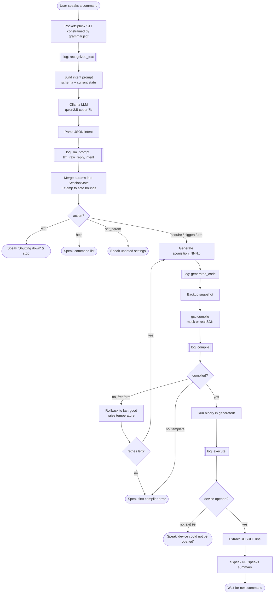
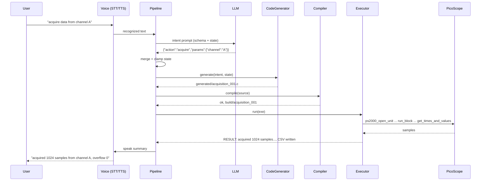

# Pipeline Flowcharts

## End-to-end command flow

```mermaid
flowchart TD
    START([User speaks a command]) --> STT[PocketSphinx STT<br/>constrained by grammar.jsgf]
    STT --> LOG1[[log: recognized_text]]
    LOG1 --> PROMPT[Build intent prompt<br/>schema + current state]
    PROMPT --> LLM[Ollama LLM<br/>qwen2.5-coder:7b]
    LLM --> JSON[Parse JSON intent]
    JSON --> LOG2[[log: llm_prompt, llm_raw_reply, intent]]
    LOG2 --> MERGE[Merge params into SessionState<br/>+ clamp to safe bounds]
    MERGE --> ROUTE{action?}

    ROUTE -->|exit| EXIT([Speak 'Shutting down' & stop])
    ROUTE -->|help| HELP([Speak command list])
    ROUTE -->|set_param| CONF([Speak updated settings])
    ROUTE -->|acquire / siggen / arb| GEN[Generate acquisition_NNN.c]

    GEN --> LOG3[[log: generated_code]]
    LOG3 --> BK[Backup snapshot]
    BK --> COMP[gcc compile<br/>mock or real SDK]
    COMP --> LOG4[[log: compile]]
    LOG4 --> OK{compiled?}

    OK -->|no, freeform| ROLL[Rollback to last-good<br/>raise temperature] --> RETRY{retries left?}
    RETRY -->|yes| GEN
    RETRY -->|no| FAILSPK([Speak first compiler error])
    OK -->|no, template| FAILSPK
    OK -->|yes| RUN[Run binary in generated/]

    RUN --> LOG5[[log: execute]]
    LOG5 --> DEV{device opened?}
    DEV -->|no, exit 99| DEVSPK([Speak 'device could not be opened'])
    DEV -->|yes| RESULT[Extract RESULT: line]
    RESULT --> SPEAK[eSpeak NG speaks summary]
    SPEAK --> LOOP([Wait for next command])
```

## Sequence view (one acquire command)

```mermaid
sequenceDiagram
    participant U as User
    participant V as Voice (STT/TTS)
    participant P as Pipeline
    participant L as LLM
    participant G as CodeGenerator
    participant C as Compiler
    participant E as Executor
    participant D as PicoScope

    U->>V: "acquire data from channel A"
    V->>P: recognized text
    P->>L: intent prompt (schema + state)
    L-->>P: {"action":"acquire","params":{"channel":"A"}}
    P->>P: merge + clamp state
    P->>G: generate(intent, state)
    G-->>P: generated/acquisition_001.c
    P->>C: compile(source)
    C-->>P: ok, build/acquisition_001
    P->>E: run(exe)
    E->>D: ps2000_open_unit ... run_block ... get_times_and_values
    D-->>E: samples
    E-->>P: RESULT: acquired 1024 samples..., CSV written
    P->>V: speak summary
    V-->>U: "acquired 1024 samples from channel A, overflow 0"
```
